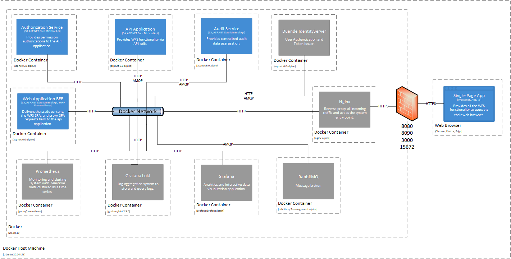

# ASP.NET Core 6.0 Multi-Service Application
This repository aims to demonstrate the use of ASP.NET Core 6.0 to build a multi-service  application.


## Architecture
An architectur documentation is provided under the architecture directory.

### Context View


### Container View


## Code Usage
To compile and run the code locally the latest .NET 6 SDK is required. The SDK can be installed as part of the Visual Studio setup or standalone separate installation.
The solution was developed and tested using Visual Studio 2022.

## Users
Following are the test users defined in the system:
1. Username: bob, Password: bob, Privilege: Full Access.
1. Username: alice, Password: alice, Privilege: No Access.


## Docker Deployment
The next steps can be followed to run the application. The following was tested on an Ubuntu 20.04.

1. While in the repository change directory to docker
```
cd docker
```

2. Generate SSL certificate.
```
bash create-cert.sh $(uname -n)
```

3. Build the docker images.
```
bash build.sh
```

4. Run the containers using docker compose.
```
bash up.sh $(uname -n)
```

5. Ports published.
   * 8080 The BFF web application used to deliver the SPA.
   * 8090 The IdentityServer application.
   * 3000 The Grafana portal.
   * 15672 RabbitMQ management portal.

6. Get the hostname.
```
uname -n
```

7. Access the application through the host name.
```
https://<hostname>:8080
```

### Deployment View

